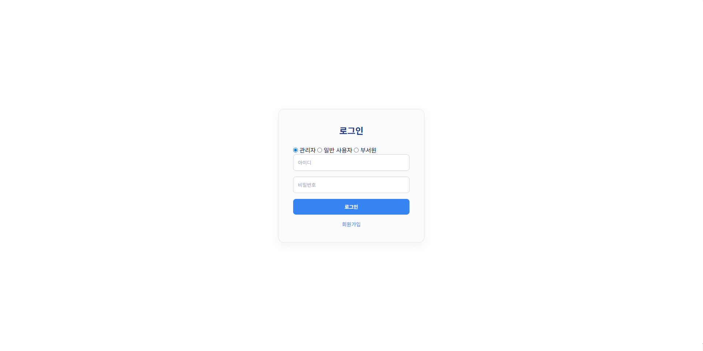
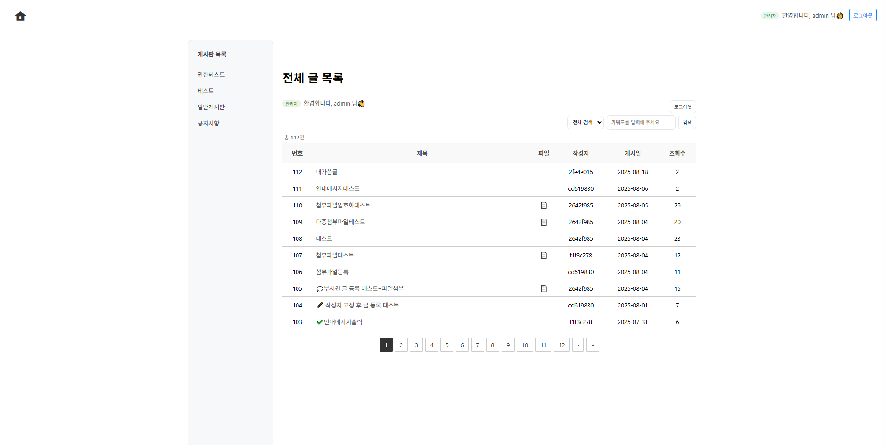
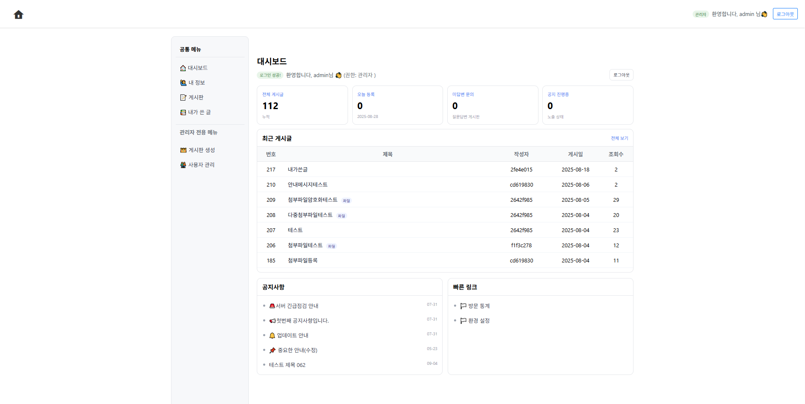
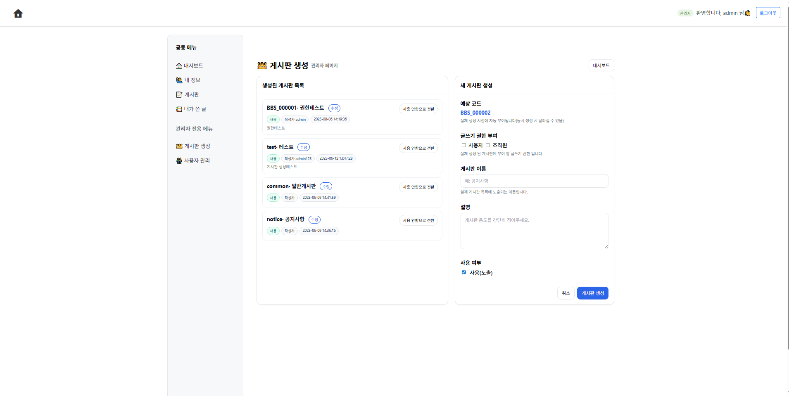

# 📌 Test_CMS_Project

✅ **eGovFrame 4.3 / MySQL 8.0 / JDK 17 / Apache Tomcat 9.0**

---

## 🚀 Features
- 게시판 CRUD (네이버 스마트에디터 적용)
- 로그인 & 회원가입 (Spring Security 적용) 
- 마이페이지 (회원정보 수정: 비밀번호, 이름, 전화번호) & 내가 쓴 글 조회
- 내가 쓴 글 조회
- 관리자 페이지
  - 메뉴 생성 및 권한 기반 접근 제어
  - 회원 관리 (조회, 수정, 엑셀 다운로드)

---

## 🛠️ Tech Stacks

&nbsp;
&nbsp;
&nbsp;
&nbsp;

---

## ☁ ERD Cloud
[🔗 ERD Cloud 보기](https://www.erdcloud.com/d/GaWjmogfKTHgBzbSd)

---

## 📷 Screenshots
| 로그인 | 게시판 | 메인 | 관리자페이지 |
|--------|--------|------|--------------|
|  |  |  |  |

---

## 📦 프로젝트 구조
